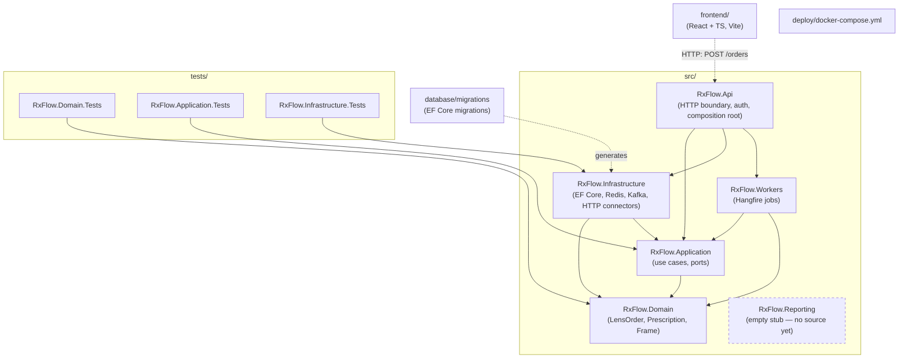
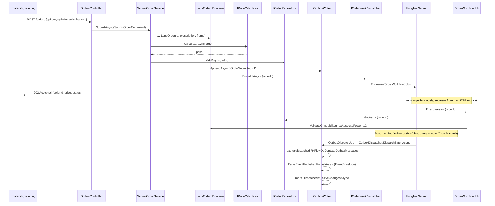
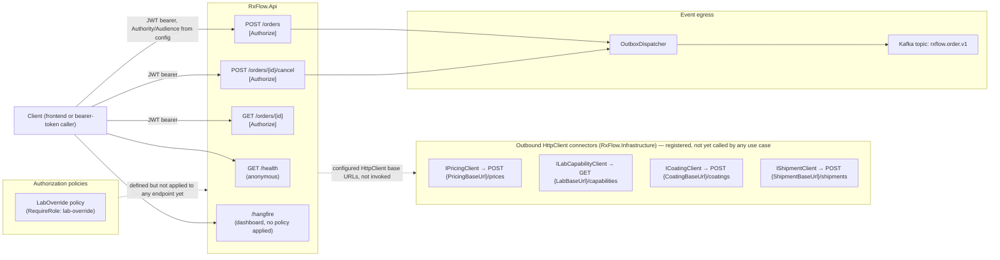

# RxFlow diagrams

Participant-facing architecture diagrams reflecting the code as it exists today (2026-08-28, matching `docs/acceptance-evidence.md`). These describe structure and control flow only — no seeded-defect locations or answer keys; those stay in the sibling `../instructor` directory per `Agents.md`.

## 1. Repository / project structure

Solid arrows are compile-time project references (`RxFlow.slnx`); the dashed arrow is a runtime HTTP call, not a project reference.

**Notes**

- `RxFlow.Reporting` is declared in `RxFlow.slnx` and `architecture.md` but currently contains only a `.csproj` — no source files, no reporting test project exists yet (Phase 7 of `docs/implementation-plan.md` is not started).
- Dependency direction matches `subagents.md`'s collaboration protocol: `Domain` has no outgoing dependencies; `Application` depends only on `Domain`; `Infrastructure`/`Workers`/`Api` depend inward, never sideways into each other's internals.

## 2. Code / request flow

Two independent flows exist today: the synchronous `POST /orders` path, and the Hangfire-scheduled outbox dispatch. They are not yet connected end-to-end to Kafka consumers or lab/coating/shipment connectors (see notes).

**Notes**

- `IOrderRepository` is bound to `LocalOrderRepository` (an in-memory `ConcurrentDictionary`, [src/RxFlow.Api/LocalAdapters.cs](../src/RxFlow.Api/LocalAdapters.cs)) in `Program.cs`; `EfOrderRepository` exists in `RxFlow.Infrastructure` but is not registered there today, so orders do not currently persist to PostgreSQL through the API composition root as configured.
- `IOrderWorkDispatcher` is registered twice in `Program.cs` — `LocalWorkDispatcher` first, then `HangfireOrderWorkDispatcher` — the later registration wins, so dispatch actually goes through Hangfire.
- No Kafka **consumer** exists yet in `RxFlow.Workers`; the outbox path only publishes. Nothing currently reads `rxflow.order.v1` back into order status.
- `OrderWorkflowJob` only validates grindability; it does not yet call lab-routing, scheduling, coating, or shipment — those use cases are not implemented (Phases 5/6 of `docs/implementation-plan.md`).

## 3. API / integration surface

**Notes**

- Business endpoints today: `POST /orders`, `GET /orders/{id}`, `POST /orders/{id}/cancel` (all `[Authorize]`), plus `GET /health` (anonymous) and the reporting endpoints on `ReportsController`. `POST /orders/{id}/cancel` calls `CancelOrderService`, which transitions the order to `Rejected` via the existing domain rule, persists it through `IOrderRepository.UpdateAsync`, and writes an `OrderCancelled.v1` outbox record — it does not enqueue a Hangfire job. The `lab-override` authorization policy is defined in `Program.cs` but no endpoint currently requires it — there is no lab-override workflow implemented yet (open item in `Requirements.md`).
- The four outbound connectors (`Pricing`, `LabCapability`, `Coating`, `Shipment`) are wired into DI with configurable base URLs (`ConnectorOptions`) but are not called from `SubmitOrderService` or `OrderWorkflowJob` today — pricing actually goes through the in-process `LocalPriceCalculator`, not `PricingClient`.
- CORS is scoped to a single allowed origin (`http://localhost:5173`) for the local Vite frontend.
